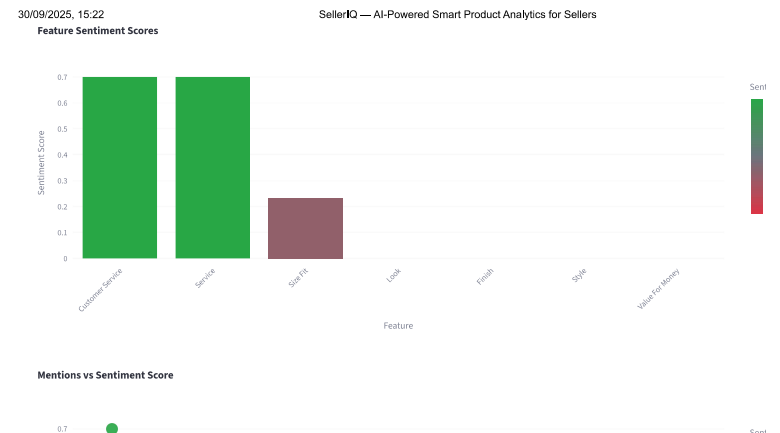
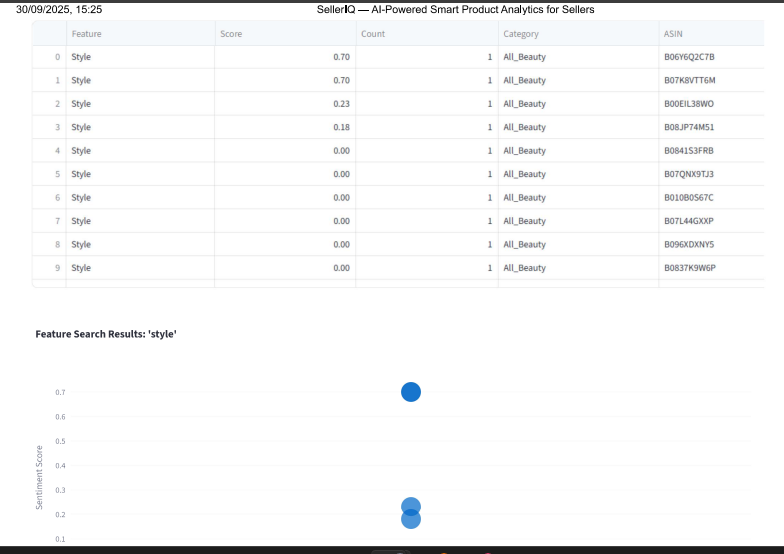
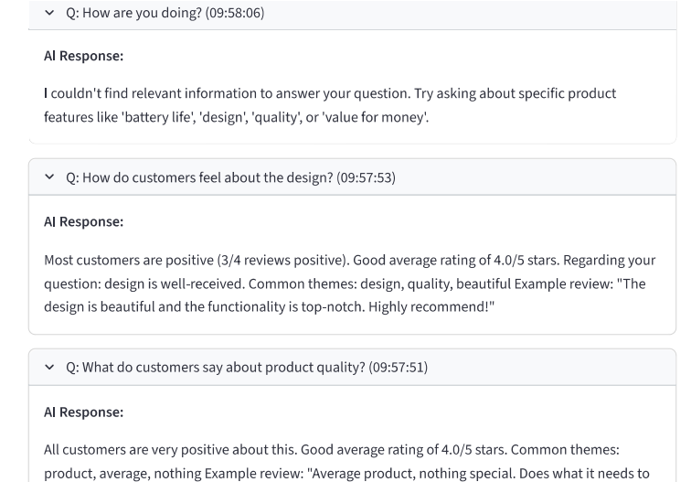

# SellerIQ - Smart Product Analytics for Sellers

This project implements an end-to-end ML pipeline for extracting sentiment-driven product feature insights from Amazon reviews using the McAuley-Lab/Amazon-Reviews-2023 dataset.

## Architecture Overview

The system processes Amazon reviews through the following pipeline:
1. **Data Ingestion**: Download reviews from Hugging Face and upload to S3
2. **Aspect Extraction**: Extract product features using NLP techniques
3. **Sentiment Analysis**: Analyze sentiment for each feature
4. **Aggregation**: Store aggregated insights in DynamoDB
5. **API & Dashboard**: Serve insights via REST API and Streamlit dashboard

## Repository Structure

```
/repo
  /data_ingest          # Data download and S3 upload
  /models               # ML model training and inference
    /aspect_extractor   # Aspect extraction models
    /sentiment         # Sentiment analysis models
  /inference           # Model serving and inference
  /api                 # REST API with OpenAPI spec
  /dashboard           # Streamlit visualization dashboard
  /infra               # Terraform infrastructure as code
  /ci                  # GitHub Actions CI/CD
  /tests               # Unit and integration tests
  /docs                # Documentation and model cards
```

## Quick Start

### Prerequisites
- Python 3.10+
- AWS CLI configured
- Terraform installed
- Docker (for containerized deployment)

### 1. Data Ingestion
```bash
cd data_ingest
pip install -r requirements.txt
python download_and_upload.py \
  --dataset_id "McAuley-Lab/Amazon-Reviews-2023" \
  --subset "raw_review_All_Beauty" \
  --s3_bucket "your-bucket-name" \
  --s3_prefix "raw/All_Beauty" \
  --num_samples 1000
```

### 2. Infrastructure Setup
```bash
cd infra
terraform init
terraform plan
terraform apply
```

### 3. Model Training
```bash
cd models/sentiment
python train_sentiment.py --train_file ../data/train.jsonl
```

### 4. API Deployment
```bash
cd api
# Deploy via Terraform or manually
```

### 5. Dashboard
```bash
cd dashboard
pip install -r requirements.txt
streamlit run streamlit_app.py
```

## Environment Variables

Create a `.env` file with:
```
AWS_REGION=us-east-1
S3_BUCKET=your-bucket-name
DYNAMODB_TABLE=product_sentiment_insights
SAGEMAKER_ENDPOINT=your-endpoint-name
```

## Dataset Attribution

This project uses the McAuley-Lab/Amazon-Reviews-2023 dataset from Hugging Face:
- Dataset: https://huggingface.co/datasets/McAuley-Lab/Amazon-Reviews-2023
- License: Please refer to the dataset's license terms

## Results

The sample results generated by project in PDF format:

| Product Analysis Report                             | Search Feature Analysis Report                       | AI Assistant Chat Report                            |
|----------------------------------------------------|-----------------------------------------------------|----------------------------------------------------|
| [Hair Product Analysis.pdf](docs/results/hair_product_analysis.pdf) | [Style Search Feature Analysis.pdf](docs/results/style_search_feature_analysis.pdf) | [AI Assistant Chat.pdf](docs/results/AI_assistant_chat.pdf) |

### Preview of results (page snapshots):

<p float="left">
  
  
  
</p>

<!-- <p float="left">
  
</p>

<p float="left">
  
</p> -->


## Contributing

1. Fork the repository
2. Create a feature branch
3. Make your changes
4. Add tests
5. Submit a pull request

## License

This project is licensed under the MIT License - see the LICENSE file for details.